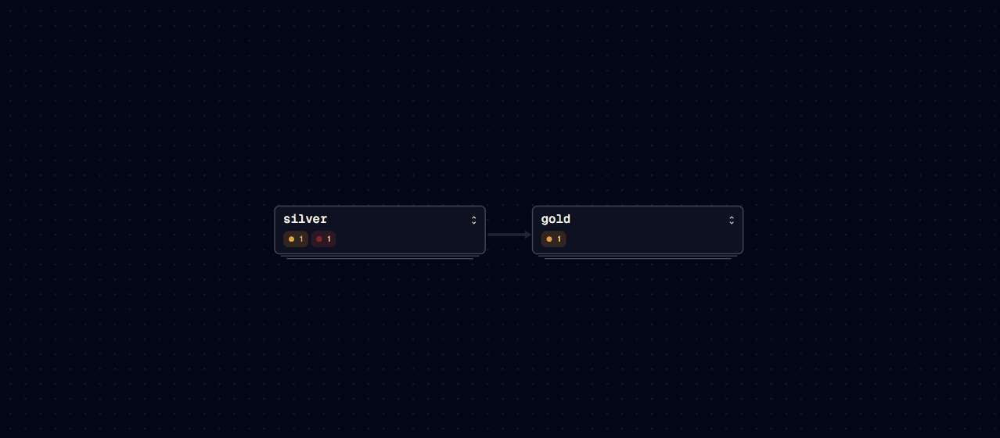
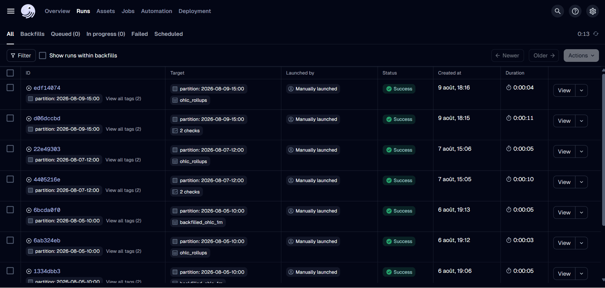

# crypto-realtime-pipeline

[](https://github.com/Sidi4PF/crypto-realtime-pipeline/actions/workflows/ci.yml)

A production-shaped streaming data platform built end to end: live Binance trades
ingested through Redpanda, aggregated into OHLC candles by Spark Structured
Streaming, stored as partitioned Parquet on S3, orchestrated by Dagster, and
served through a live Streamlit dashboard. Infrastructure is provisioned with
Terraform and the whole thing runs locally with a single command.

## Architecture

See [docs/architecture.md](docs/architecture.md) for the full diagram.

Streaming runs as three independent Spark jobs. `bronze_job` archives raw trades,
`silver_job` writes closed 1-minute candles to S3, and `live_job` republishes the
in-progress candle to a Kafka topic. Isolating them started as a debugging
necessity and turned out to be the better shape: a failing stateful job no longer
stops raw archival.

Two read paths feed the dashboard. The current candle comes from the Kafka topic
for sub-second latency, while history is read from S3 Parquet through DuckDB. The
dashboard never polls object storage in a loop.

## Demo

The dashboard, current candle streamed from Kafka while history is read from S3
through DuckDB:


The asset graph, showing both silver sources feeding the rollups:



One hour of streaming output compacted from 180 files to 3, with the two data
quality checks:



## Layers

| Layer  | Content                | Written by                            | Partitioning       |
| ------ | ---------------------- | ------------------------------------- | ------------------ |
| bronze | Raw trades as received | Spark streaming                       | symbol, date, hour |
| silver | 1-minute OHLC candles  | Spark streaming, compacted by Dagster | symbol, date, hour |
| gold   | 5m, 15m and 1h rollups | Dagster                               | date, hour         |

## Measured behaviour

Numbers below come from actual runs, not estimates.

| Metric                         | Value                                         |
| ------------------------------ | --------------------------------------------- |
| Websocket to broker lag        | 50 ms at best, 700 to 900 ms sustained        |
| Trade throughput               | 25 to 30 trades per second across 3 symbols   |
| Silver files before compaction | 180 per hour, one per symbol per minute       |
| Silver files after compaction  | 3 per hour, a 60 to 1 reduction               |
| Backfill throughput            | 60 candles per symbol per hour, one REST call |

## Running it

### Fully local, no AWS account needed

```bash
cp .env.example .env
# set S3_ENDPOINT to http://minio:9000 in the compose services
docker compose -f docker/compose.yml --env-file .env --profile compute up
```

MinIO stands in for S3. Nothing is billed.

### Against real AWS

```bash
cd infra
cp terraform.tfvars.example terraform.tfvars   # set your alert email
terraform init
terraform apply
terraform output bucket_name
terraform output -raw secret_access_key
```

Copy the outputs into `.env`, leave `S3_ENDPOINT` empty, then:

```bash
docker compose -f docker/compose.yml --env-file .env --profile serve up
```

The producer runs on the host during development:

```bash
python -m producer.main
```

The dashboard is on `http://localhost:8501`, Redpanda console on `:8080`,
Dagster on `:3000` with the `orchestrate` profile.

### Tests

```bash
docker compose -f docker/compose.yml --profile compute run --rm --no-deps \
  -v "$(pwd)/docker/run-tests.sh:/opt/app/run-tests.sh" \
  --entrypoint bash spark-silver /opt/app/run-tests.sh
```

The aggregation logic is a pure function over DataFrames, so it is tested on a
static frame without Kafka or a running stream. CI runs the same script in the
same image.

## Design decisions

### Redpanda over Kafka

Kafka needs a broker plus either Zookeeper or a KRaft setup, and its memory
footprint is uncomfortable on a 16 GB laptop running Spark alongside it. Redpanda
ships as a single binary, speaks the Kafka protocol, and runs in a 1 GB container.
Every client library and every concept transfers directly to Kafka. Nothing in the
code is Redpanda-specific.

### Explicit partition mapping instead of key hashing

The first version let the client hash the symbol key. With only three distinct
keys and three partitions, murmur2 collided: one partition held 92 percent of
messages and another held none. Symbols are now mapped to partitions explicitly.
The tradeoff is that adding a symbol shifts the mapping of the ones after it,
which is acceptable for a fixed symbol set and would need consistent hashing if
the catalogue became dynamic.

### min on a struct, not first

`first()` and `last()` are not deterministic in a distributed aggregation because
arrival order is not guaranteed. Open and close are computed as `min`/`max` over a
struct whose leading field is the trade timestamp, with the trade id breaking
ties. Lexicographic struct comparison then gives a reproducible result. A test
feeds deliberately out-of-order trades and asserts the candle is correct.

### Watermark of 10 seconds

Sustained websocket lag sits under a second, so 10 seconds leaves an order of
magnitude of margin. It absorbs a brief network stall while keeping streaming
state small. A five-minute watermark, the common reflex, would hold five minutes
of open windows in memory for no benefit.

### foreachBatch instead of the Parquet sink

Silver is written through `foreachBatch` doing a plain batch Parquet write, not
through `writeStream.format("parquet")`. The streaming sink maintains a
transactional `_spark_metadata` log that does not survive contact with a stateful
operator when the target is S3. See the debugging notes below.

### Plain Parquet, not Iceberg or Delta

A table format would add a moving part on top of Spark, Dagster and S3 without
adding to the story. More importantly, keeping plain Parquet makes the small-file
problem visible and turns compaction into a real, measurable Dagster job rather
than something hidden behind an `OPTIMIZE` call. Iceberg is the natural next step
if schema evolution or time travel became requirements.

### DuckDB for batch, Spark for streaming

An hourly rollup covers 180 candles, a few hundred kilobytes. Starting a JVM for
that would be absurd. Spark handles the stream, DuckDB handles the batch
analytics. The tool follows the volume, not the trend.

### Two output modes for two purposes

Silver is written in `append` mode so a candle is persisted only once the
watermark has closed its window, never rewritten. The dashboard topic is written
in `update` mode so the in-progress candle refreshes every two seconds. Same
aggregation, different jobs, different guarantees.

### One switch between local and cloud

`S3_ENDPOINT` is the only difference between MinIO and real S3. Set, it selects
path-style access with static credentials; empty, it falls back to the standard
AWS credential chain. Switching from local development to AWS required changing
one environment variable and zero lines of Python.

### force_destroy on the bucket

Deliberate for a demo project: it allows a clean `terraform destroy` even with
objects present. It would be unacceptable in production.

## Debugging notes

Two failures cost real time and are worth writing down, because neither surfaced
as an error.

### The stateful query that silently wrote nothing

**Symptom.** The bronze stream wrote thousands of Parquet files to S3 while the
silver stream, reading the same topic in the same job, wrote none. No exception,
no failed batch. Spark committed batch after batch, each reporting
`numInputRows: 0` and a watermark frozen at `1970-01-01T00:00:00Z`.

**What it was not.** The frozen watermark looked like the cause, so the first
hypotheses all targeted it: a broken event-time column, a schema mismatch making
`from_json` return nulls, Kafka offsets ahead of the topic after a topic
recreation, clock drift between the container and the host, a session-wide
watermark held at zero by a stateless query running alongside. Each was ruled out
by isolating it. The event-time column was correct, the payload parsed cleanly,
the offsets were behind the high watermarks, the clocks matched, and splitting the
queries into separate jobs changed nothing.

**What it was.** A console-sink probe running the exact same `compute_ohlc` in the
same session produced candles normally, which narrowed the difference to a single
variable: the sink. The streaming Parquet sink maintains a transactional
`_spark_metadata` log. On S3, where renames are not atomic, that commit protocol
interacts badly with a stateful operator and the batch never actually starts.
Rewriting the sink with `foreachBatch`, doing a plain batch Parquet write per
micro-batch, fixed it immediately.

The lesson is not about Spark. It is that `numInputRows: 0` was a consequence, not
a cause, and every hour spent on the watermark was spent on a symptom.

### The state store on a Windows bind mount

Before the sink issue, the same query crashed with
`Error reading delta file [...] 1.delta does not exist`. Spark's default
`HDFSBackedStateStoreProvider` writes delta files that were unreadable moments
after being written when the checkpoint directory was a Docker bind mount backed
by NTFS. Moving the checkpoint to a named Docker volume, and switching to
`RocksDBStateStoreProvider`, resolved it. Stateless queries were unaffected, which
is why bronze kept working throughout and made the problem look sink-specific when
it was not yet.

Switching state store providers requires a fresh checkpoint location. RocksDB
cannot read state written by the HDFS-backed provider, and says so explicitly.

## Known limitations

- Spark runs in local mode across three containers. Cluster deployment is out of
  scope.
- Exactly-once delivery is not guaranteed end to end. Checkpointing plus
  deduplication at compaction time gives effective idempotence for this use case.
- No schema registry. The payload is small and stable, and JSON parsing is done
  against an explicit Spark schema rather than inferred.
- Backfill and streaming write to the same silver location. Running both for the
  same hour would produce duplicates, resolved at compaction but wasteful.
- The live job triggers every two seconds, which is at the edge of what three
  concurrent Spark drivers absorb on a 16 GB laptop.

## Stack

Python 3.11, Redpanda, PySpark 3.5 Structured Streaming, DuckDB, Dagster,
Terraform, Streamlit, Plotly, Docker Compose, GitHub Actions, AWS S3 and IAM.

## License

MIT
