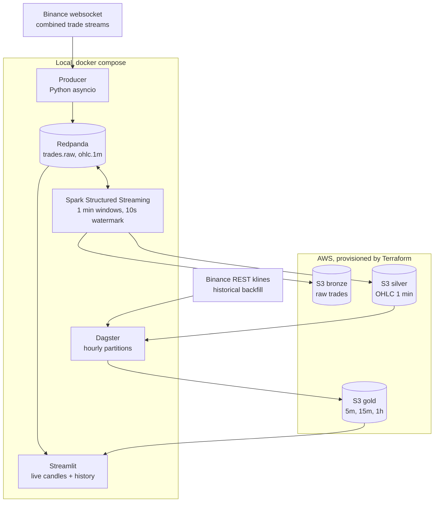

# Architecture

```mermaid
flowchart TB
    binance["Binance websocket<br/>combined trade streams"]

    subgraph local["Local, docker compose"]
        producer["Producer<br/>Python asyncio"]
        redpanda[("Redpanda<br/>trades.raw, ohlc.1m")]
        spark["Spark Structured Streaming<br/>1 min windows, 10s watermark"]
        dashboard["Streamlit<br/>live candles + history"]
        dagster["Dagster<br/>hourly partitions"]
    end

    subgraph aws["AWS, provisioned by Terraform"]
        bronze[("S3 bronze<br/>raw trades")]
        silver[("S3 silver<br/>OHLC 1 min")]
        gold[("S3 gold<br/>5m, 15m, 1h")]
    end

    rest["Binance REST klines<br/>historical backfill"]

    binance --> producer --> redpanda
    redpanda <--> spark
    redpanda --> dashboard
    spark --> bronze
    spark --> silver
    silver --> dagster
    rest --> dagster
    dagster --> gold
    gold --> dashboard
```
