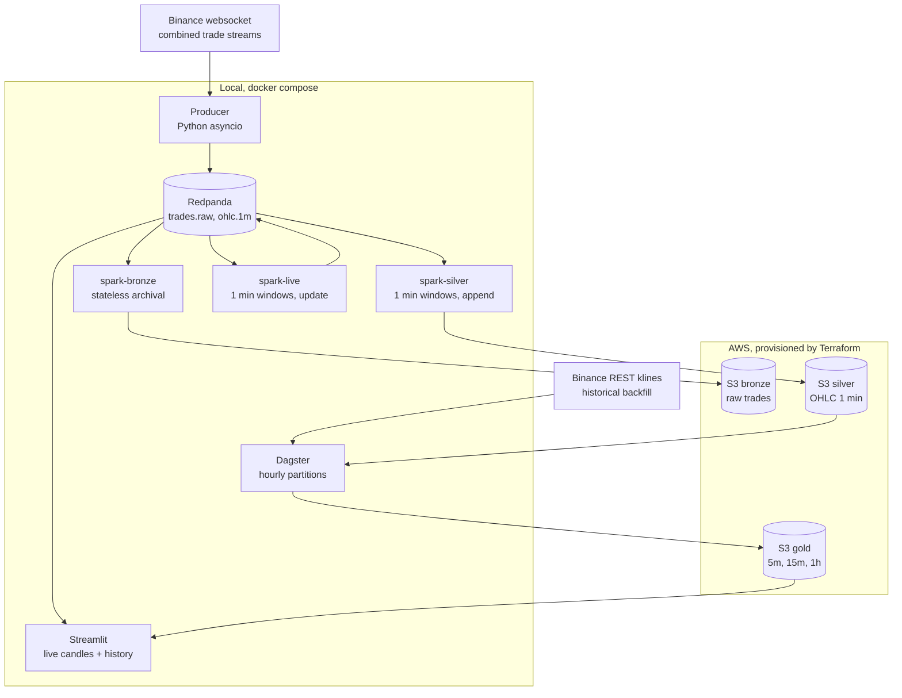

# Architecture

## Why three Spark jobs

Each streaming query runs in its own Spark driver and its own container. The three
have different failure modes and different guarantees: `spark-bronze` is stateless
and must never stop, `spark-silver` is stateful and writes only closed windows,
`spark-live` is stateful and republishes the in-progress candle every two seconds.

Isolating them started as a debugging necessity, documented in the main README,
and turned out to be the better shape. A stateful job that fails no longer takes
raw archival down with it, and each can be restarted, resized or reasoned about
independently.

## Checkpoints

All three jobs share the `checkpoint-data` Docker volume, each under its own
subdirectory. The volume is a named Docker volume rather than a bind mount: Spark
state stores do not survive on NTFS through Docker Desktop.
